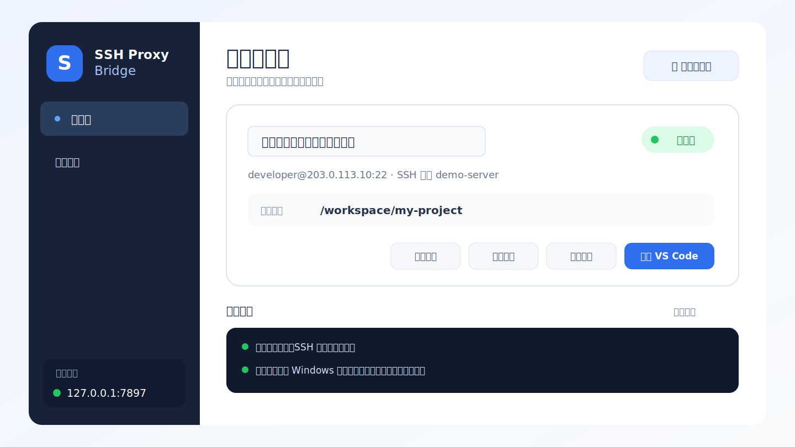
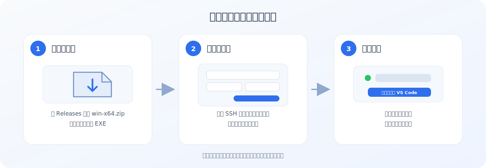
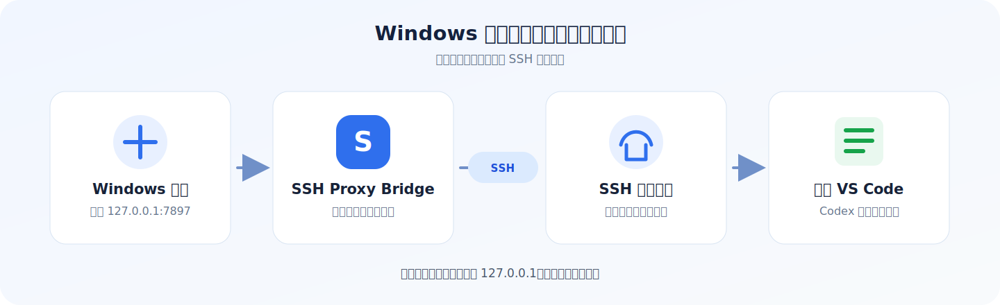

# SSH Proxy Bridge

[](https://github.com/zhourunnan1210/ssh-proxy-bridge/actions/workflows/ci.yml)
[](LICENSE)
[](https://github.com/zhourunnan1210/ssh-proxy-bridge/releases/latest)

**让远程服务器上的 VS Code 和 Codex 使用 Windows 本机代理。**

你的 Windows 可以通过代理联网，但 SSH 服务器上的 Codex 连不上？

打开 SSH Proxy Bridge，填入服务器信息和本机代理端口，再点击一次连接。它会自动建立 SSH 代理通道，并用 VS Code 打开指定的远程项目。

[**下载 Windows 版本**](https://github.com/zhourunnan1210/ssh-proxy-bridge/releases/latest) · [查看完整用户手册](USER_GUIDE.md)



> 上图使用的是示例服务器信息，不包含真实地址或账号。

## 它帮你做什么

平时使用 VS Code Remote-SSH 时，程序和 Codex 扩展实际运行在远程服务器上。服务器不会自动使用你 Windows 电脑上的代理，所以可能无法访问需要的网络服务。

SSH Proxy Bridge 会：

- 检查 Windows 本机代理是否已经启动。
- 通过 SSH 把本机代理安全地带到远程服务器。
- 为服务器设置 Codex 等工具能够识别的代理环境。
- 直接用 VS Code 打开你指定的远程项目目录。
- 保存多个服务器，下次只需选择服务器并点击连接。

## 三步开始使用



### 1. 下载并解压

打开 [Releases](https://github.com/zhourunnan1210/ssh-proxy-bridge/releases/latest)，下载名称类似下面的文件：

```text
SSH-Proxy-Bridge-v0.1.0-win-x64.zip
```

不要下载 GitHub 自动生成的 `Source code`。下载完成后右键选择“全部解压”，不要直接在压缩包预览窗口里运行程序。

### 2. 添加服务器

双击解压目录中的 `SshProxyBridge.exe`，然后点击“添加服务器”。你只需要准备：

- SSH 服务器地址、端口、用户名和密码。
- Windows 代理地址和端口，例如 `127.0.0.1:7897`。
- 希望 VS Code 打开的服务器目录，例如 `/workspace/my-project`。

第一次连接时，软件会让你确认服务器的 SSH 主机指纹。确认服务器身份后，程序会自动配置后续使用所需的 SSH Key。

### 3. 连接并打开 VS Code

确认代理软件正在运行，然后选择服务器并点击“连接并打开 VS Code”。

连接成功后，VS Code 会直接打开远程目录。以后日常使用通常只有四步：

> 启动代理软件 → 打开 SSH Proxy Bridge → 选择服务器 → 点击连接

## 工作原理



它使用 SSH 反向隧道，把服务器上的本地代理入口连接到 Windows 代理。服务器侧入口默认只监听 `127.0.0.1`，不会直接向服务器外部网络开放。

## 使用前需要准备

- Windows 10/11 x64。
- 已经启动的 HTTP、HTTPS 或 mixed 代理软件。
- VS Code 和 Microsoft Remote - SSH 扩展。
- 一台可以通过 SSH 登录的 Linux 服务器。
- 服务器允许公钥认证和 TCP 端口转发。
- 需要在远程环境中使用的 VS Code 扩展，例如 Codex。

发行包已经包含 .NET 运行时，普通用户不需要另外安装 .NET SDK。

## 常见问题

<details>
<summary><strong>本机代理左侧的圆点是灰色</strong></summary>

先确认 Windows 代理软件已经启动，再检查填写的代理端口是否与代理软件一致。常见地址是 `127.0.0.1`，端口由你的代理软件决定。

</details>

<details>
<summary><strong>Windows 提示“未知发布者”</strong></summary>

当前版本没有商业代码签名证书。请只从本项目 Releases 页面下载，并根据[下载与文件校验说明](docs/DOWNLOAD_AND_VERIFY.md)核对 SHA-256 后再运行。

</details>

<details>
<summary><strong>SSH 初始化或登录失败</strong></summary>

检查服务器地址、SSH 端口、用户名和密码，并确认服务器允许密码登录、公钥认证与 TCP 端口转发。仍然失败时，点击软件中的“运行诊断”查看具体环节。

</details>

<details>
<summary><strong>VS Code 已打开，但 Codex 仍然无法联网</strong></summary>

先在 SSH Proxy Bridge 中运行诊断，确认“本机代理”“SSH 隧道”和“服务器代理联网”均正常，然后重新连接 VS Code Remote-SSH 窗口。

</details>

## 安全与隐私

- 服务器密码不会写入普通配置文件、日志或命令行。
- 选择“保存密码”时，密码保存在当前 Windows 用户的 Credential Manager。
- 首次连接需要人工确认服务器 SSH 主机指纹。
- 后续连接使用严格主机密钥检查，服务器身份变化时不会静默放行。
- 程序只追加自身缺失的 SSH 公钥，不覆盖服务器现有的 `authorized_keys`。
- 每个服务器使用独立配置、状态目录和受管 SSH Key。

更完整的安全模型和漏洞报告方式请参阅 [SECURITY.md](SECURITY.md)。

## 更多文档

- [完整用户手册](USER_GUIDE.md)：界面说明、服务器管理、诊断和常见问题。
- [下载与文件校验](docs/DOWNLOAD_AND_VERIFY.md)：SmartScreen、SHA-256 和完整解压说明。
- [开发说明](app/README.md)：源码结构和本地开发。
- [贡献指南](CONTRIBUTING.md)：提交代码前需要遵守的约束。
- [产品需求文档](PRODUCT_REQUIREMENTS.md)：产品设计和后续规划。
- [第三方组件](THIRD_PARTY_NOTICES.md)：开源依赖和许可证。

## 从源码运行

开发者需要安装 .NET 8 SDK，然后在仓库目录执行：

```powershell
.\start-ssh-proxy-bridge-gui.cmd
```

构建、测试和发行说明请查看[开发说明](app/README.md)与[贡献指南](CONTRIBUTING.md)。

## English summary

SSH Proxy Bridge is a Windows desktop application that lets remote Linux development environments use a proxy running on the local Windows computer. It creates a managed SSH reverse tunnel and opens the selected remote folder with VS Code Remote-SSH.

## 声明

SSH Proxy Bridge 是独立的开源项目，与 Microsoft 或 OpenAI 没有关联，也未获得其认可或背书。VS Code、Remote-SSH、OpenAI 和 Codex 是其各自权利人的商标或产品名称。

## License

[MIT](LICENSE) © 2026 SSH Proxy Bridge contributors.
