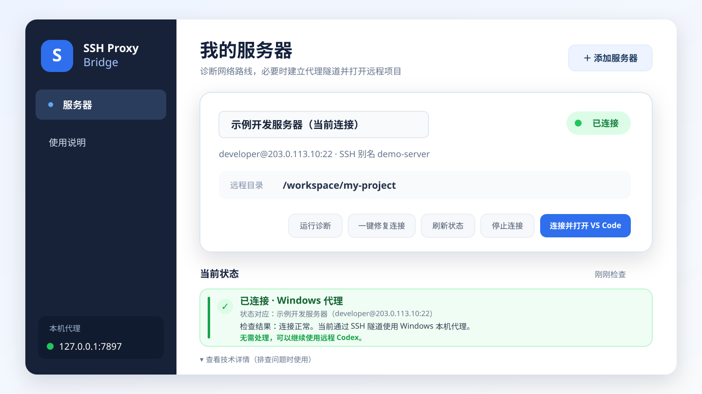
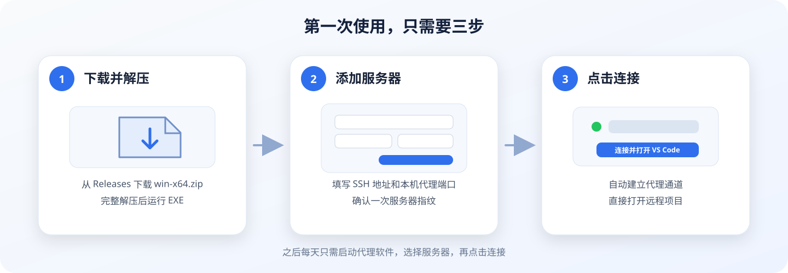
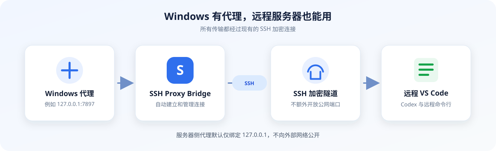

# SSH Proxy Bridge

[](https://github.com/zhourunnan1210/ssh-proxy-bridge/actions/workflows/ci.yml)
[](LICENSE)
[](https://github.com/zhourunnan1210/ssh-proxy-bridge/releases/latest)

**自动为远程服务器上的 VS Code 和 Codex 选择可用网络：服务器直连优先，Windows 本机代理兜底。**

你的 Windows 可以通过代理联网，但 SSH 服务器上的 Codex 连不上？

打开 SSH Proxy Bridge，填入服务器信息和本机代理设置，再点击一次连接。程序会先从服务器测试 Codex 的真实接口：直连可用就直接使用服务器网络；直连不可用才建立 SSH 代理通道，随后用 VS Code 打开指定的远程项目。

[**下载 Windows 版本**](https://github.com/zhourunnan1210/ssh-proxy-bridge/releases/latest) · [查看完整用户手册](USER_GUIDE.md)



> 上图使用的是示例服务器信息，不包含真实地址或账号。

## 它帮你做什么

平时使用 VS Code Remote-SSH 时，程序和 Codex 扩展实际运行在远程服务器上。服务器不会自动使用你 Windows 电脑上的代理，所以可能无法访问需要的网络服务。

SSH Proxy Bridge 会：

- 从服务器直接检查 Codex 接口是否可达。
- 直连不可用时检查并按配置启动 Windows 本机代理。
- 仅在需要时通过 SSH 把本机代理安全地带到远程服务器。
- 为服务器设置 Codex 等工具能够识别的直连或代理环境。
- 直接用 VS Code 打开你指定的远程项目目录。
- 在网络波动或 SSH 被重置后自动检查并重建受管隧道。
- 用醒目的彩色状态卡直接说明“是否正常、当前是哪台服务器、下一步做什么”，技术详情默认折叠。
- 保存多个服务器，下次只需选择服务器并点击连接。

## 三步开始使用



### 1. 下载并解压

打开 [Releases](https://github.com/zhourunnan1210/ssh-proxy-bridge/releases/latest)，下载名称类似下面的文件：

```text
SSH-Proxy-Bridge-v0.2.3-win-x64.zip
```

不要下载 GitHub 自动生成的 `Source code`。下载完成后右键选择“全部解压”，不要直接在压缩包预览窗口里运行程序。

### 2. 添加服务器

双击解压目录中的 `SshProxyBridge.exe`，然后点击“添加服务器”。你只需要准备：

- SSH 服务器地址、端口、用户名和密码。
- Windows 代理地址和端口，例如 `127.0.0.1:7897`。
- 希望 VS Code 打开的服务器目录，例如 `/workspace/my-project`。

第一次连接时，软件会让你确认服务器的 SSH 主机指纹。确认服务器身份后，程序会自动判断服务器支持公钥还是只支持密码网关，并配置对应的连接方式。

### 3. 连接并打开 VS Code

选择服务器并点击“连接并打开 VS Code”。软件会自动判断服务器应当直连还是使用 Windows 代理；只有需要代理回退且未配置自动启动时，才需要你手动打开代理软件。

连接成功后，VS Code 会直接打开远程目录。以后日常使用通常只有四步：

> 打开 SSH Proxy Bridge → 选择服务器 → 点击连接 → 自动选择直连或代理

## 工作原理



当服务器无法直连 Codex 时，它使用 SSH 反向隧道，把服务器上的本地代理入口连接到 Windows 代理。服务器侧入口默认只监听 `127.0.0.1`，不会直接向服务器外部网络开放。服务器能够直连时不会新建代理隧道。

## 使用前需要准备

- Windows 10/11 x64。
- 已经启动的 HTTP、HTTPS 或 mixed 代理软件。
- VS Code 和 Microsoft Remote - SSH 扩展。
- 一台可以通过 SSH 登录的 Linux 服务器。
- 服务器允许 TCP 端口转发。普通服务器建议允许公钥认证；只允许密码认证的云平台 SSH 网关也受支持。
- 需要在远程环境中使用的 VS Code 扩展，例如 Codex。

发行包已经包含 .NET 运行时，普通用户不需要另外安装 .NET SDK。

## 常见问题

<details>
<summary><strong>本机代理左侧的圆点是灰色</strong></summary>

先确认 Windows 代理软件已经启动，再检查填写的代理端口是否与代理软件一致。常见地址是 `127.0.0.1`，端口由你的代理软件决定。

</details>

<details>
<summary><strong>Windows 提示“未知发布者”</strong></summary>

当前版本没有商业代码签名证书。请只从本项目 Releases 页面下载，并根据[下载与文件校验说明](docs/DOWNLOAD_AND_VERIFY.md)核对 SHA-256 后再运行。

</details>

<details>
<summary><strong>SSH 初始化或登录失败</strong></summary>

检查服务器地址、SSH 端口、用户名和密码，并确认服务器允许 TCP 端口转发。软件会自动识别普通公钥服务器和只允许密码的云平台网关；密码网关需要勾选“保存密码”。仍然失败时，点击软件中的“运行诊断”查看具体环节。

</details>

<details>
<summary><strong>VS Code 已打开，但 Codex 仍然无法联网</strong></summary>

先点击“刷新状态”。新版会直接用中文说明失败层级。若显示橙色“隧道正常 · 需重载 VS Code”，说明通道已经恢复，但运行中的 Codex 无法热更新网络环境；点击“一键修复连接”，保存工作后可在内嵌确认面板选择“重载并重新连接”。软件会重新打开远程目录并复验，只有 Codex 真正采用新路线后才显示绿色。

每次检查结果都会在彩色“当前状态”卡片中标明对应服务器，并直接给出建议操作；底部英文进程输出已经收纳到默认折叠的“查看技术详情（排查问题时使用）”。切换服务器时，上一台服务器尚未返回的结果会被丢弃，当前服务器会自动重新检查，因此不会再把另一台服务器的 SSH 或登录状态显示到当前卡片。

</details>

<details>
<summary><strong>隧道会因为网络波动突然中断吗？</strong></summary>

可能。电脑网络切换、休眠、路由器或服务器重置 TCP 连接时，SSH 会退出。成功连接后，SSH Proxy Bridge 会启动独立的自动修复监控；即使关闭 GUI，它也会继续检查，条件恢复后按退避策略重建隧道。点击“停止连接”会同时停止监控和隧道。

</details>

## 安全与隐私

- 服务器密码不会写入普通配置文件、日志或命令行。
- 选择“保存密码”时，密码保存在当前 Windows 用户的 Credential Manager。
- 对只允许密码认证的 SSH 网关，受控 AskPass Helper 会按需读取该凭据；运行配置、环境变量和临时文件中都没有明文密码。
- 首次连接需要人工确认服务器 SSH 主机指纹。
- 后续连接使用严格主机密钥检查，服务器身份变化时不会静默放行。
- 在普通服务器上，程序只追加自身缺失的 SSH 公钥，不覆盖服务器现有的 `authorized_keys`。
- 每个服务器使用独立配置和状态目录；普通服务器还使用独立受管 SSH Key。

更完整的安全模型和漏洞报告方式请参阅 [SECURITY.md](SECURITY.md)。

## 更多文档

- [完整用户手册](USER_GUIDE.md)：界面说明、服务器管理、诊断和常见问题。
- [下载与文件校验](docs/DOWNLOAD_AND_VERIFY.md)：SmartScreen、SHA-256 和完整解压说明。
- [开发说明](docs/development/DEVELOPMENT.md)：源码结构和本地开发。
- [贡献指南](CONTRIBUTING.md)：提交代码前需要遵守的约束。
- [产品需求文档](docs/development/PRODUCT_REQUIREMENTS.md)：产品设计和后续规划。
- [第三方组件](THIRD_PARTY_NOTICES.md)：开源依赖和许可证。

## 从源码运行

日常使用只双击仓库根目录的 `SshProxyBridge.exe`。开发者首次拉取源码或修改代码后，需要安装 .NET 8 SDK，然后在仓库目录执行：

```powershell
.\start-ssh-proxy-bridge-gui.cmd
```

这个脚本会构建最新便携版、更新根目录的唯一日常入口并启动它。不要运行 `app/**/bin`、`app/**/obj` 或旧 `release` 目录中的 EXE。

构建、测试和发行说明请查看[开发说明](docs/development/DEVELOPMENT.md)与[贡献指南](CONTRIBUTING.md)。

## 目录结构

| 目录或文件 | 用途 |
|---|---|
| `SshProxyBridge.exe` | 唯一日常 GUI 入口。 |
| `ssh-proxy-bridge.ps1` | GUI 调用的运行时连接引擎。 |
| `app/` | .NET 应用、核心库与自动化测试源码。 |
| `docs/` | 用户下载说明、图片和开发文档。 |
| `scripts/build/` | 打包与本地发布脚本。 |
| `scripts/legacy/` | 仅用于旧 `config.local.json` 的兼容工具。 |
| `release/` | 当前版本的便携包、ZIP 和校验文件。 |

## English summary

SSH Proxy Bridge is a Windows desktop application that lets remote Linux development environments use a proxy running on the local Windows computer. It creates a managed SSH reverse tunnel and opens the selected remote folder with VS Code Remote-SSH.

## 声明

SSH Proxy Bridge 是独立的开源项目，与 Microsoft 或 OpenAI 没有关联，也未获得其认可或背书。VS Code、Remote-SSH、OpenAI 和 Codex 是其各自权利人的商标或产品名称。

## License

[MIT](LICENSE) © 2026 SSH Proxy Bridge contributors.
